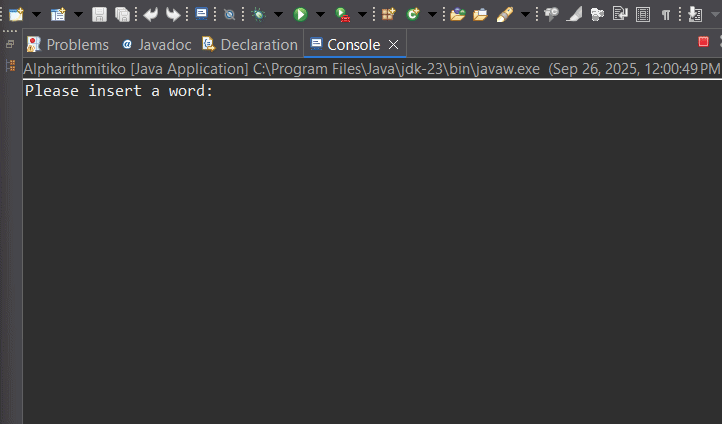

## Demo

This repository contains the Word Length Checker program implemented in the Alpharithmitiko class in the alpha package. 
The program asks the user to enter a word or phrase and returns a boolean indicating whether the total length of the string is greater than 10 characters.

Features:

• Language: Java

• Main class: Alpharithmitiko

• Package: alpha

• Input: String from the user (Scanner)

• Output: "The result is: true" or "The result is: false" depending on the length

• Basic logic: Method foo(String s) that returns s.length() > 10.

Instructions for use:
1. Clone or add the files to the repository.
2. Make sure you have JDK installed.
3. Compile:
• javac alpha/Alpharithmitiko.java
4. Run:
• java alpha.Alpharithmitiko
5. Type the word or phrase when prompted. The program displays the result.

In the demo:

• The program reads a line from the user with Scanner.nextLine(), so it never receives null in normal use.

• The length calculation is done with s.length(), so spaces and Unicode characters are counted as they appear in the string.

• Each example shows the input the user types and the expected output.

Improvement suggestions:

• Check for null or empty inputs and display messages.

• Use s.trim() to ignore extraneous whitespace.

• Add a limit parameter (e.g. limit as a command line argument).

• Unit tests for the foo method with JUnit.
